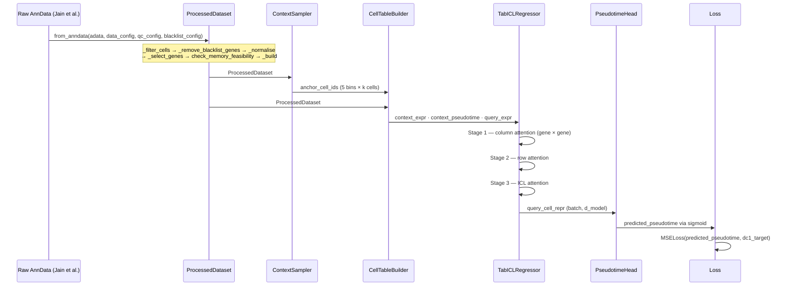
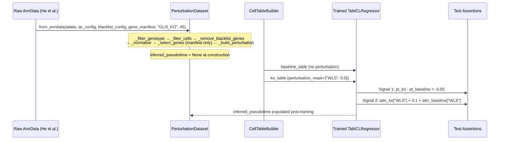
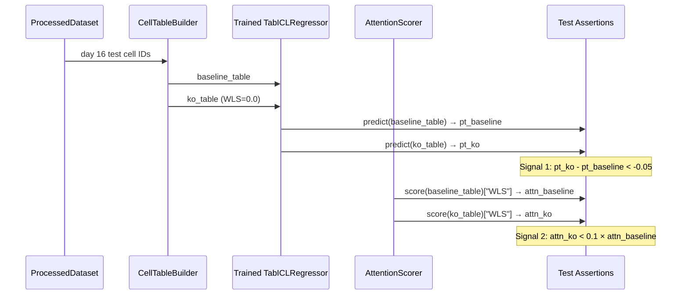

# Technical Design Document
## TabGRN-ICL: Tabular Foundation Model for Dynamic GRN Inference

**Version:** 1.1.0
**Status:** Rotation Scope Active · Full Project Stubs Present
**Project:** Joint rotation — Queen Mary University London / University College London
**Supervisors:** Dr. Julien Gautrot · Dr. Yanlan Mao · Dr. Isabel Palacios
**Author:** Christian Langridge
**Last Updated:** March 2026

**Changelog v1.1.0**
- §2: `errors.py` added; directory structure updated to reflect AnnData-native pipeline and new test layout
- §3.2: `ProcessedDataset` rewritten — `from_anndata()` constructor, pipeline steps, `QCConfig`, `GeneBlacklist`
- §3.2a–3.2d: New subsections for `PerturbationDataset`, `QCConfig`, `GeneBlacklist`, `GENOTYPE_MAP`
- §5.5: `check_memory_feasibility()` moved to module-level; signature updated
- §8: Fixtures, test files, and critical tests updated to reflect implemented RED phase
- §10: 16 plan-mode decisions added

---

## Table of Contents

1. [System Overview](#1-system-overview)
2. [Directory Structure](#2-directory-structure)
3. [Component Specifications](#3-component-specifications)
4. [Workflow & Data Flow](#4-workflow--data-flow)
5. [Implementation Details](#5-implementation-details)
6. [Integration Guide](#6-integration-guide)
7. [Configuration Reference](#7-configuration-reference)
8. [Test Architecture](#8-test-architecture)
9. [Deployment & Compute](#9-deployment--compute)
10. [Decision Log](#10-decision-log)

---

## 1. System Overview

### 1.1 Architectural Goals

TabGRN-ICL is a tabular in-context learning model for dynamic gene regulatory network (GRN) inference from single-cell RNA sequencing data. It is trained on the Jain et al. 2025 (Nature) brain organoid time-course dataset and targets two simultaneous prediction objectives:

| Objective | Output | Head | Status |
|---|---|---|---|
| Pseudotime regression | Scalar ∈ (0, 1) mapping to DC1 | `PseudotimeHead` | **Rotation scope — active** |
| Cell state composition | K-vector of Dirichlet parameters | `CompositionHead` | Full project — Phase 5A |

The model uses the **TabICLv2** pre-trained backbone, adapted for continuous regression targets via a dual-head output architecture. Column-wise attention (stage 1) is the primary source of GRN signal — it learns gene-gene regulatory dependencies as a byproduct of trajectory prediction, without requiring a prior adjacency matrix.

### 1.2 Core Design Principles

- **Explicit over implicit.** Every hyperparameter lives in `ExperimentConfig`. No magic numbers in implementation code.
- **Schema contracts at construction.** Both `ProcessedDataset` and `PerturbationDataset` validate their own schemas at build time. Failures surface immediately, not mid-training.
- **Phase gates.** Full-project components exist in the codebase as tested skeletons. They are not wired into training until their phase gate is explicitly opened (`model.enable_composition_head()`).
- **Tests as first-class artifacts.** RED phase tests are written before implementation. The WLS perturbation integration test is the only test with a wet-lab validated expected answer.
- **Hardware-tier portability.** Three named hardware tiers (`debug`, `standard`, `full`) ensure reproducibility across laptop, V100, and A100 without code changes.

### 1.3 Scientific Context

The model operates on the Matrigel-only condition of the Jain et al. 2025 time-course, which tracks brain organoid development across five collection days: 5, 7, 11, 16, 21. Pseudotime is sourced directly from the paper's Diffusion Component 1 (DC1), which is validated against chronological collection day in Figure 2b. Day 11 cells are withheld as a test set — they represent the neuroectoderm-to-neuroepithelial transition, the hardest interpolation point on the trajectory.

The WLS gene serves as the primary biological validation target. Jain et al. Figure 5h–k demonstrates that WLS knockout prevents non-telencephalic fate induction. The model's in-silico WLS knockout must reproduce this directional prediction.

**Day-45/55 WT cells are explicitly excluded from training.** WT cells from the He et al. day-45/55 timepoints cannot be meaningfully placed on the Jain et al. DC1 pseudotime axis (which spans days 5–21 only). Adding them as training data would corrupt the regression target. They are not needed as inference baselines because the in-silico WLS perturbation (`CellTableBuilder` masking `WLS=0.0`) serves as the computational baseline.

---

## 2. Directory Structure

```
SMT-Pipeline/
├── pyproject.toml                      # Package registration — pip install -e .
├── smt_pipeline.yml                    # Conda environment
├── slurm_jobs.sh                       # Myriad HPC job scripts (all tiers)
├── LICENSE
├── README.md
│
├── experiments/                        # Auto-created at runtime
│   └── {run_id}/
│       ├── config.json                 # Serialised ExperimentConfig (every run)
│       ├── metrics.json                # MAE · attention_entropy · top20_bio_overlap
│       ├── shap_background.npy         # Locked SHAP background (created once, frozen)
│       └── checkpoints/
│           └── best_model.pt
│
├── data/
│   ├── raw/                            # Raw AnnData objects — never modified
│   │   ├── jain_2025_matrigel_wt.h5ad  # Jain et al. 2025 — WT days 5/7/11/16/21
│   │   └── he_2022_gli3ko_day45.h5ad   # He et al. 2022 — GLI3-KO day 45
│   └── model_data/
│       └── fleck_2022/                 # External validation — Fleck et al. 2022
│
├── path/
│   └── spatialmt/                      # Installable package root
│       │
│       ├── __init__.py
│       ├── errors.py                   # SpatialMTError · ConfigurationError · DataIntegrityError
│       │
│       ├── config/
│       │   ├── __init__.py             # Re-exports: Dirs, Paths, PROJECT_ROOT
│       │   ├── paths.py                # Filesystem path resolution (env var + sentinel walk)
│       │   └── experiment.py           # ExperimentConfig + all sub-configs
│       │
│       ├── data/
│       │   ├── __init__.py
│       │   └── dataset.py              # ProcessedDataset · PerturbationDataset
│       │                               # QCConfig · GeneBlacklist · GENOTYPE_MAP
│       │                               # check_memory_feasibility() · _compute_manifest_hash()
│       │
│       ├── context/
│       │   ├── __init__.py
│       │   ├── sampler.py              # ContextSampler — 5-bin pseudotime stratification
│       │   └── builder.py              # CellTableBuilder — unified matrix construction
│       │
│       ├── model/
│       │   ├── __init__.py
│       │   ├── tabicl.py               # TabICLRegressor — main model wrapper
│       │   ├── heads/
│       │   │   ├── __init__.py
│       │   │   ├── pseudotime.py       # PseudotimeHead — sigmoid scalar output
│       │   │   └── composition.py      # CompositionHead — Dirichlet K-vector [Phase 5A]
│       │   └── baselines/
│       │       ├── __init__.py
│       │       ├── xgboost_baseline.py
│       │       ├── tabpfn_baseline.py  # [Phase 6]
│       │       ├── no_icl_baseline.py  # [Phase 6]
│       │       └── scratch_baseline.py # [Phase 6]
│       │
│       ├── training/
│       │   ├── __init__.py
│       │   ├── trainer.py
│       │   ├── callbacks.py
│       │   ├── scheduler.py
│       │   └── loss.py
│       │
│       ├── explainability/
│       │   ├── __init__.py
│       │   ├── protocols.py
│       │   ├── scorers.py
│       │   ├── report.py
│       │   └── perturbation.py
│       │
│       └── evaluation/
│           ├── __init__.py
│           ├── metrics.py
│           ├── benchmark.py
│           └── external.py             # [Phase 7]
│
├── src/
│   └── experiments/
│       ├── run_tabicl_finetune.py
│       ├── run_xgboost_baseline.py
│       ├── run_tabicl_scratch.py       # [Phase 6]
│       ├── run_tabicl_no_icl.py        # [Phase 6]
│       └── run_full_dual_head.py       # [Phase 5A]
│
└── tests/
    ├── conftest.py                     # Root path fix: adds path/ to sys.path
    ├── unit/
    │   ├── conftest.py                 # Shared fixtures: synthetic AnnData objects,
    │   │                               # mock configs, mock manifests, built datasets
    │   ├── data/
    │   │   ├── test_pipeline_steps.py  # Per-step unit tests (filter·blacklist·norm·select·build)
    │   │   ├── test_perturbation_dataset.py  # Schema, manifest alignment, WLS column
    │   │   └── test_genotype_map.py    # GENOTYPE_MAP, _parse_genotype, cell filtering
    │   └── config/
    │       └── test_qc_presets.py      # QCConfig/GeneBlacklist presets, memory check
    ├── smoke/
    │   └── test_toy_forward_pass.py
    ├── integration/
    │   ├── test_hold_out_split.py
    │   └── test_wls_perturbation.py
    └── biological_sanity/
        └── test_sox2_attention.py
```

---

## 3. Component Specifications

### 3.1 `ExperimentConfig`
**File:** `path/spatialmt/config/experiment.py`

**Purpose:** Single source of truth for all hyperparameters. Serialised to `experiments/{run_id}/config.json` at training startup. Every run is fully reproducible from its config file alone.

**Sub-configs:**

| Sub-config | Key fields | Notes |
|---|---|---|
| `DataConfig` | `max_genes`, `test_timepoint=11`, `hardware_tier`, `n_cell_states=5`, `label_softening_temperature=1.0` | `log1p_transform` is validated as `True` at construction; raises if `False` |
| `ContextConfig` | `n_bins=5`, `cells_per_bin=5`, `max_context_cells=50`, `allow_replacement=True` | Validates `n_bins × cells_per_bin ≤ max_context_cells` |
| `ModelConfig` | `lr_col=1e-5`, `lr_row=1e-4`, `lr_icl=5e-5`, `lr_emb=1e-3`, `lr_head=1e-3`, `warmup_col_steps=500`, `warmup_icl_steps=100`, `output_head_init_bias=0.5`, `output_head_init_std=0.01` | `bio_plausibility_passed` populated post-training |
| `ExplainabilityConfig` | `shap_background_size=100`, `shap_background_seed=42`, `bio_plausibility_required=["SOX2"]` | SOX2 absence in top-20 triggers fallback strategy |
| `PerturbationConfig` | `perturbation_mask={"WLS": 0.0}`, `pseudotime_delta_threshold=-0.05`, `attention_drop_fraction=0.1`, `composition_shift_threshold=0.05` | Signal 3 (composition) active only after `enable_composition_head()` |
| `BenchmarkConfig` | `baselines=["tabicl_finetune","xgboost"]` (rotation) | Full suite adds scratch, no_icl, tabpfn_v2 in Phase 6 |

**Named presets:**

```python
ExperimentConfig.debug_preset()           # 128 genes, CPU, 2 cells/bin
ExperimentConfig.rotation_finetune()      # 512 genes, V100, pseudotime only
ExperimentConfig.rotation_xgboost()       # XGBoost baseline, same HVG set
ExperimentConfig.full_finetune()          # 1024 genes, A100, dual-head [Phase 5A]
ExperimentConfig.scratch_preset()         # No pretrained weights [Phase 6]
ExperimentConfig.no_icl_preset()          # Single cell input [Phase 6]
```

**Dependencies:** `spatialmt.config.paths.Paths`, `dataclasses`, `json`, `hashlib`

---

### 3.2 `ProcessedDataset`
**File:** `path/spatialmt/data/dataset.py`

**Purpose:** Immutable, schema-validated container for the Jain et al. WT timecourse training data. Constructed directly from a raw-count AnnData object via `from_anndata()`. Every downstream component receives this object; raw files are never accessed after construction.

**Constructor:**

```python
ProcessedDataset.from_anndata(
    adata,              # Raw UMI count AnnData — Jain et al. days 5–21 WT
    data_config,        # DataConfig — provides max_genes, test_timepoint
    qc_config,          # QCConfig — cell filtering thresholds
    blacklist_config,   # GeneBlacklist — genes to remove before HVG selection
    gene_manifest,      # FeatureManifest | None — if provided, bypasses HVG
    dc1_col="DC1",      # obs column name for pseudotime
    day_col="day",      # obs column name for collection day
    gpu_memory_bytes=8*1024**3,
)
```

**Pipeline (hardcoded order — Decision 14A):**

```
_filter_cells
    → _remove_blacklist_genes      (returns removed gene list for logging)
        → _normalise               (CP10k + log1p, sparse-native)
            → _select_genes        (HVG flavor="seurat" or frozen manifest)
                → check_memory_feasibility()
                    → _build       (densify, assemble frozen dataclass)
```

**Fields:**

| Field | Shape | Type | Notes |
|---|---|---|---|
| `expression` | `(n_cells, n_genes)` | `np.float32` | CP10k + log1p, dense after `_build()` |
| `gene_names` | `(n_genes,)` | `list[str]` | HVG names in column order |
| `pseudotime` | `(n_cells,)` | `np.float32` | DC1 values from obs column |
| `collection_day` | `(n_cells,)` | `np.int32` | ∈ {5, 7, 11, 16, 21} |
| `cell_ids` | `(n_cells,)` | `list[str]` | Cell barcodes |
| `test_mask` | `(n_cells,)` | `np.bool_` | `True` where `collection_day == test_timepoint` (day 11) |
| `manifest_hash` | scalar | `str` | SHA-256 of `sorted(gene_names)` — gene-space identity check |
| `preprocessing_config` | — | `dict` | JSON-serialisable record of all preprocessing decisions including `removed_genes`, `selected_genes`, QC thresholds |

**Private pipeline steps (each independently unit-testable — Decision 5A):**

```python
ProcessedDataset._filter_cells(adata, qc_config)
    # → raises ValueError("No cells remain after QC filtering") if all cells removed

ProcessedDataset._remove_blacklist_genes(adata, blacklist, return_removed=False)
    # → returns (filtered_adata, removed_genes) when return_removed=True

ProcessedDataset._normalise(adata)
    # → CP10k + log1p; result stays sparse; zero-count cells → 0.0 (not NaN)

ProcessedDataset._select_genes(adata, data_config, gene_manifest)
    # → HVG path (gene_manifest is None): flavor="seurat", bypasses LOESS when
    #   max_genes >= n_vars (avoids seurat_v3 singularity on small AnnDatas)
    # → Manifest path: validates all manifest genes present, raises ValueError
    #   with missing gene name if any are absent

ProcessedDataset._build(adata, gene_names, data_config, dc1_col, day_col, preprocessing_config)
    # → densifies sparse matrix, assembles frozen dataclass
```

**Ordering guarantee:** `_select_genes` is called after `_normalise`. HVG selection on raw counts is biologically invalid — the pipeline ordering test (`test_select_genes_called_after_normalise`) enforces this via monkeypatching.

**Manifest hash:** `SHA-256(json.dumps(sorted(gene_names)))` — gene names only, not expression data or preprocessing config. This allows `wt.manifest_hash == ko.manifest_hash` to hold even when QC configs legitimately differ between datasets (Decision 15A).

**Dependencies:** `numpy`, `scanpy`, `scipy.sparse`, `spatialmt.errors.ConfigurationError`

---

### 3.2a `PerturbationDataset`
**File:** `path/spatialmt/data/dataset.py`

**Purpose:** He et al. 2022 GLI3-KO day-45 dataset prepared for perturbation inference. A sibling class to `ProcessedDataset` (not a subclass — Decision 1A) that shares the same pipeline steps but adds a genotype-filtering step and requires a frozen `FeatureManifest` from a previously built `ProcessedDataset`.

**Constructor:**

```python
PerturbationDataset.from_anndata(
    adata,              # Raw UMI count AnnData — He et al. (WT + KO cells mixed)
    qc_config,          # QCConfig — may differ from WT (he_gli3_ko_day45() preset)
    blacklist_config,   # GeneBlacklist — may differ from WT (no histone removal)
    gene_manifest,      # FeatureManifest — REQUIRED; raises ValueError if None
    target_genotype,    # "GLI3_KO" — cells mapped via GENOTYPE_MAP
    collection_day,     # int scalar — 45
    organoid_col="organoid",
    gpu_memory_bytes=8*1024**3,
)
```

**Additional pipeline step (Step 0, before QC):**

```
_filter_genotype(adata, target_genotype, organoid_col)
    # → maps obs[organoid_col] values through GENOTYPE_MAP via _parse_genotype()
    # → keeps only cells where canonical label == target_genotype
    # → raises ValueError if 0 cells of target_genotype are present
```

**Fields:**

| Field | Type | Notes |
|---|---|---|
| `expression` | `np.float32 (n_ko_cells, n_genes)` | CP10k + log1p; WLS column is 0.0 (knocked out) |
| `gene_names` | `list[str]` | Identical to WT `ProcessedDataset.gene_names` |
| `cell_ids` | `list[str]` | KO cell barcodes only |
| `collection_day` | `int` | Scalar — 45. Not an array (all cells same day) |
| `inferred_pseudotime` | `np.ndarray \| None` | **`None` at construction** — populated post-training by model inference (Decision 3A mod) |
| `manifest_hash` | `str` | Must equal WT `ProcessedDataset.manifest_hash` for compatible datasets |
| `preprocessing_config` | `dict` | JSON-serialisable; includes `target_genotype`, `collection_day`, `removed_genes` |

**Key invariant:** `wt_dataset.manifest_hash == ko_dataset.manifest_hash` — the runtime check that the two datasets share a gene space. Will differ if `max_genes` changes between builds.

**Gene manifest is required.** `gene_manifest=None` raises `ValueError` immediately. The manifest is always the `gene_names` list from the previously built `ProcessedDataset`, wrapped in a `FeatureManifest` object.

**Dependencies:** `numpy`, `scanpy`, `scipy.sparse`, `spatialmt.errors.ConfigurationError`

---

### 3.2b `QCConfig`
**File:** `path/spatialmt/data/dataset.py`

**Purpose:** Frozen dataclass specifying cell-filtering thresholds. Named presets encode the published QC decisions from each paper as executable documentation. Any threshold change causes a preset test to fail, forcing an explicit decision rather than silent drift.

```python
@dataclasses.dataclass(frozen=True)
class QCConfig:
    min_genes:          int     # minimum detected genes per cell
    max_genes_per_cell: int     # doublet proxy
    min_umi:            int     # minimum total UMI
    max_umi:            int     # maximum total UMI
    max_pct_mt:         float   # fraction (0.0–1.0), NOT percentage
```

**Named presets:**

| Preset | `min_genes` | `max_pct_mt` | Source |
|---|---|---|---|
| `QCConfig.jain_timecourse()` | 501 | 0.099 | Jain et al. 2025 — "*> 500 genes, < 10 % mitochondrial*" |
| `QCConfig.he_gli3_ko_day45()` | 200 | 0.20 | He et al. 2022 — placeholder; confirm from real AnnData |

**Note on boundary encoding:** `min_genes=501` implements "*more than 500*" because `_filter_cells` uses `>= min_genes`. Similarly `max_pct_mt=0.099` implements "*less than 10%*". These encode the paper's strict inequalities without requiring special-case logic in the filter.

**Serialisation:** `dataclasses.asdict(qc_config)` produces a JSON-serialisable dict stored in `preprocessing_config["qc"]`.

---

### 3.2c `GeneBlacklist`
**File:** `path/spatialmt/data/dataset.py`

**Purpose:** Frozen dataclass controlling which gene categories are removed before HVG selection. Named presets encode the per-paper preprocessing choices. `WLS` is never removed by any blacklist configuration — its name does not match any prefix pattern, and this is explicitly verified by test.

```python
@dataclasses.dataclass(frozen=True)
class GeneBlacklist:
    mito:    bool   # removes MT- prefixed genes
    ribo:    bool   # removes RPL / RPS prefixed genes
    histone: bool   # removes HIST prefixed genes
```

**Named presets:**

| Preset | `mito` | `ribo` | `histone` | Rationale |
|---|---|---|---|---|
| `GeneBlacklist.jain_timecourse()` | ✅ | ✅ | ✅ | Histone genes are cell-cycle correlated; bias pseudotime ordering in proliferating early organoid cells |
| `GeneBlacklist.he_gli3_ko_day45()` | ✅ | ✅ | ❌ | Histone removal not documented in He et al.; omitted to avoid undocumented differences from paper |

**Key method:**

```python
blacklist.get_genes_to_remove(adata) -> list[str]
# Returns gene names matching active prefix patterns.
# Returns [] when all flags are False.
# WLS is never returned regardless of flag combination.
```

**Removed genes** are logged in `preprocessing_config["removed_genes"]` as a plain `list[str]`.

---

### 3.2d `GENOTYPE_MAP` and `_parse_genotype`
**File:** `path/spatialmt/data/dataset.py`

**Purpose:** Explicit allowlist mapping raw AnnData `organoid` column values to canonical genotype literals. Unknown labels fail loudly with an actionable error pointing to the map. Never perform ad-hoc string matching outside this mechanism.

```python
GENOTYPE_MAP: dict[str, Literal["WT", "GLI3_KO"]] = {
    "H9":        "WT",
    "H9_GLI3KO": "GLI3_KO",
}

def _parse_genotype(raw_label: str) -> Literal["WT", "GLI3_KO"]:
    # Raises ValueError if raw_label not in GENOTYPE_MAP.
    # Error message includes: offending label, "GENOTYPE_MAP", list of known labels.
```

**⚠️ Action required before first real run:** Inspect `he_2022_gli3ko_day45.h5ad` for the exact unique values in `adata.obs["organoid"]` and update `GENOTYPE_MAP` to match. The current mapping is based on expected naming conventions; the actual strings may differ.

---

### 3.3 `ContextSampler`
**File:** `path/spatialmt/context/sampler.py`

**Purpose:** Samples anchor cells for the ICL context window using pseudotime-stratified bin sampling. Guarantees every context window contains representation from all five developmental stages.

**Bin layout:**

| Bin | Collection day | Pseudotime range |
|---|---|---|
| 0 | Day 5 | [0.0, 0.2) |
| 1 | Day 7 | [0.2, 0.4) |
| 2 | Day 11 | withheld — excluded from sampling |
| 3 | Day 16 | [0.6, 0.8) |
| 4 | Day 21 | [0.8, 1.0] |

**Sparse bin guard:** When a bin contains fewer cells than `cells_per_bin`, sampling proceeds with replacement and a `WARNING` is logged. Setting `allow_replacement=False` in `ContextConfig` raises instead.

**Inputs:** `ProcessedDataset`, `ContextConfig`, optional `bin_edges`
**Output:** `(anchor_cell_ids: list[str], anchor_pseudotimes: np.ndarray)`

---

### 3.4 `CellTableBuilder`
**File:** `path/spatialmt/context/builder.py`

**Purpose:** Unified matrix construction for both context sampling and in-silico perturbation. Perturbation is architecturally identical to context construction with overrides applied.

**Primary method:**

```python
builder.build(
    cell_ids: list[str],
    perturbation_mask: dict[str, float] | None = None
) -> np.ndarray  # shape: (len(cell_ids), n_genes)
```

**Perturbation mask behaviour:**
- Each `{gene: value}` pair overrides the expression column for that gene
- The WLS knockout is `perturbation_mask={"WLS": 0.0}`
- Genes absent from `dataset.gene_names` log a `WARNING` and are silently skipped

---

### 3.5 `TabICLRegressor`
**File:** `path/spatialmt/model/tabicl.py`

**Three-stage attention architecture:**

| Stage | Mechanism | LR | Warmup | Biological role |
|---|---|---|---|---|
| 1 — Column | Gene × gene attention | 1e-5 | 500 steps | GRN signal — `AttentionScorer` hooks here |
| 2 — Row | Feature → cell representation | 1e-4 | None | Aggregates gene context into cell vector |
| 3 — ICL | Cell × cell, target-aware | 5e-5 | 100 steps | Predicts query relative to anchor pseudotimes |

**Phase gate:**
```python
model.enable_composition_head()
# CALL ONLY AFTER:
#   1. Pseudotime-only model passes biological plausibility gate
#   2. soft_labels validated in ProcessedDataset
#   3. NormalisedDualLoss active in Trainer
```

---

### 3.6 `PseudotimeHead`
**File:** `path/spatialmt/model/heads/pseudotime.py`

**Architecture:** `Linear(d_model, 1)` → `sigmoid` → `squeeze(-1)`

**Input:** `(batch, d_model)` query cell representation
**Output:** `(batch,)` predicted pseudotime ∈ `(0, 1)`

**Loss:** `MSELoss(predicted_pseudotime, dc1_target)`

---

### 3.7 `CompositionHead` [Phase 5A]
**File:** `path/spatialmt/model/heads/composition.py`

**Architecture:** `Linear(d_model, K)` → `softplus` → `+ 1e-6`

**K=5 cell state index mapping:**

| Index | State | Dominant timepoint |
|---|---|---|
| 0 | Neuroectodermal progenitor | Day 5 |
| 1 | Neural tube neuroepithelial | Day 7 |
| 2 | Prosencephalic progenitor | Day 11 |
| 3 | Telencephalic progenitor | Day 16 |
| 4 | Early neuron | Day 21 |

---

### 3.8 `NormalisedDualLoss` [Phase 5A]
**File:** `path/spatialmt/training/loss.py`

```python
loss = (mse_loss / mse_0) + (dir_nll_loss / dir_nll_0)
```

Both terms equal 1.0 at step zero. Active only after `model.enable_composition_head()`.

---

### 3.9 `GeneScorer` Protocol
**File:** `path/spatialmt/explainability/protocols.py`

```python
class GeneScorer(Protocol):
    @property
    def name(self) -> str: ...
    def score(self, model, dataset, query_cells) -> GeneScoreMap: ...
    def top_k(self, ..., k: int = 20) -> list[str]: ...
```

**Implementors:** `AttentionScorer`, `SHAPScorer`

---

### 3.10 `AttentionScorer`
**File:** `path/spatialmt/explainability/scorers.py`

Extracts column-attention weights from stage 1. Stage specificity guard raises `AssertionError` if hooked on row or ICL layers. Logs Shannon entropy per epoch.

---

### 3.11 `SHAPScorer`
**File:** `path/spatialmt/explainability/scorers.py`

KernelSHAP-based gene importance. Locked background saved to `experiments/{run_id}/shap_background.npy` on first call.

---

### 3.12 `ExplainabilityReport`
**File:** `path/spatialmt/explainability/report.py`

**Disagreement taxonomy:**

| Class | Condition | Biological interpretation |
|---|---|---|
| `CONCORDANT` | Both high or both low | Clean signal |
| `ATTENTION_ONLY` | High attention, low SHAP | Spurious correlation |
| `SHAP_ONLY` | Low attention, high SHAP | **GRN relay node** — primary scientific output |

---

## 4. Workflow & Data Flow

### 4.1 Training Data Flow



### 4.2 Perturbation Inference Data Flow



### 4.3 WLS Perturbation Test Flow



---

## 5. Implementation Details

### 5.1 Softplus Activation

`CompositionHead` uses `torch.nn.Softplus` to produce strictly positive Dirichlet concentration parameters.

| Activation | Issue |
|---|---|
| `ReLU` | Produces exact zero — Dirichlet undefined at α=0 |
| `exp` | Overflow risk for large positive inputs |
| `sigmoid` | Bounded to (0,1) — concentration parameters should not be capped |
| `Softplus` | Smooth, strictly positive, unbounded above, numerically stable |

### 5.2 Epsilon for Numerical Stability

```python
alpha = self.softplus(self.linear(x)) + 1e-6
```

Prevents float32 underflow to 0.0 early in training and guards `Dirichlet.log_prob()` which computes `(α-1) * log(x)` — undefined at α=0.

### 5.3 Bias Initialisation Logic

```python
# PseudotimeHead
nn.init.constant_(self.linear.bias, 0.5)   # sigmoid(0.5) ≈ 0.622 ≈ trajectory midpoint prior

# CompositionHead
nn.init.constant_(self.linear.bias, 1.0)   # softplus(1.0) ≈ 1.31 ≈ Dir(1.31,...) ≈ uniform

# Both heads
nn.init.normal_(self.linear.weight, mean=0.0, std=0.01)  # near-zero weights
```

### 5.4 Soft Label Generation [Phase 5A]

```python
def _compute_soft_labels(expression_pca, cluster_ids, config):
    centroids = {k: expression_pca[cluster_ids == k].mean(axis=0) for k in range(K)}
    distances = np.array([[np.linalg.norm(cell - centroids[k]) for k in range(K)]
                          for cell in expression_pca])
    scaled = -distances / config.label_softening_temperature
    exp_scaled = np.exp(scaled - scaled.max(axis=1, keepdims=True))
    soft_labels = exp_scaled / exp_scaled.sum(axis=1, keepdims=True)
    assert soft_labels[collection_day == 5, 0].mean() > 0.5
    return soft_labels.astype(np.float32)
```

### 5.5 Memory Feasibility Check

The check lives at **module level** in `dataset.py` — not as a method on either class. This ensures one implementation serves both `ProcessedDataset` and `PerturbationDataset` without duplication. The `label` parameter makes errors actionable.

```python
def check_memory_feasibility(
    n_cells: int,
    n_genes: int,
    gpu_memory_bytes: int,
    label: str = "dataset",
) -> None:
    """
    Raise ConfigurationError if the dense float32 expression matrix
    would exceed 80% of available GPU memory.

    Called after _select_genes() and before _build() in both
    ProcessedDataset.from_anndata() and PerturbationDataset.from_anndata().
    """
    required_bytes = n_cells * n_genes * 4   # float32
    limit_bytes    = gpu_memory_bytes * 0.8

    if required_bytes > limit_bytes:
        raise ConfigurationError(
            f"{label}: dense expression matrix would require "
            f"{required_bytes / 1e9:.2f} GB but only "
            f"{limit_bytes / 1e9:.2f} GB is available "
            f"(80% of {gpu_memory_bytes / 1e9:.2f} GB). "
            f"Reduce DataConfig.max_genes or use a higher hardware tier."
        )
```

**Tier safe limits (dense expression matrix after HVG selection):**

| Tier | `max_genes` | GPU | Peak matrix size |
|---|---|---|---|
| `debug` | 128 | CPU | ~4 MB |
| `standard` | 512 | V100 16GB | ~16 MB |
| `full` | 1024 | A100 40GB | ~32 MB |

### 5.6 Manifest Hash

```python
def _compute_manifest_hash(gene_names: list[str]) -> str:
    """
    SHA-256 of sorted(gene_names) encoded as JSON.

    Only gene_names are hashed — not preprocessing_config — so that
    wt.manifest_hash == ko.manifest_hash holds even when QC configs
    legitimately differ between the two datasets.
    """
    payload = json.dumps(sorted(gene_names), sort_keys=True)
    return hashlib.sha256(payload.encode()).hexdigest()
```

### 5.7 Sparse Normalisation (Decision 13A)

Scanpy's `normalize_total` and `log1p` operate natively on sparse matrices. Densification happens only inside `_build()`, after HVG selection has reduced the gene dimension from ~33,000 to `max_genes`. This keeps peak memory at ~16 MB (8,095 cells × 512 genes × 4 bytes) instead of ~6 GB (8,095 × 33,000 × 4 bytes).

```python
@classmethod
def _normalise(cls, adata):
    adata = adata.copy()
    sc.pp.normalize_total(adata, target_sum=1e4)   # sparse-native
    sc.pp.log1p(adata)                              # sparse-native
    return adata                                    # still sparse

@classmethod
def _build(cls, adata, gene_names, ...):
    subset = adata[:, gene_names]
    if scipy.sparse.issparse(subset.X):
        expression = subset.X.toarray().astype(np.float32)  # densify HERE only
    ...
```

---

## 6. Integration Guide

### 6.1 Building the Two Datasets

```python
import anndata as ad
from spatialmt.data.dataset import (
    ProcessedDataset, PerturbationDataset,
    QCConfig, GeneBlacklist, FeatureManifest,
)

# ── WT training dataset ────────────────────────────────────────────────
wt_adata = ad.read_h5ad("data/raw/jain_2025_matrigel_wt.h5ad")

wt_dataset = ProcessedDataset.from_anndata(
    wt_adata,
    data_config=cfg.data,                       # max_genes=512, test_timepoint=11
    qc_config=QCConfig.jain_timecourse(),
    blacklist_config=GeneBlacklist.jain_timecourse(),
    gene_manifest=None,                         # HVG selection
    dc1_col="DC1",
    day_col="day",
)

# ── KO inference dataset ────────────────────────────────────────────────
he_adata = ad.read_h5ad("data/raw/he_2022_gli3ko_day45.h5ad")

ko_dataset = PerturbationDataset.from_anndata(
    he_adata,
    qc_config=QCConfig.he_gli3_ko_day45(),
    blacklist_config=GeneBlacklist.he_gli3_ko_day45(),
    gene_manifest=FeatureManifest(wt_dataset.gene_names),  # frozen from WT
    target_genotype="GLI3_KO",
    collection_day=45,
    organoid_col="organoid",
)

# ── Runtime integrity check ─────────────────────────────────────────────
assert wt_dataset.manifest_hash == ko_dataset.manifest_hash, (
    "Gene space mismatch — rebuild both datasets with the same max_genes."
)
assert ko_dataset.inferred_pseudotime is None   # populated post-training
```

### 6.2 Rotation Scope Training Loop

```python
from spatialmt.config.experiment import ExperimentConfig
from spatialmt.context.sampler import ContextSampler
from spatialmt.context.builder import CellTableBuilder
from spatialmt.model.tabicl import TabICLRegressor
from spatialmt.explainability.scorers import AttentionScorer
from spatialmt.training.trainer import Trainer

cfg = ExperimentConfig.rotation_finetune(run_id="rotation_001")
cfg.save()

model = TabICLRegressor.load_pretrained(
    config=cfg.model,
    n_genes=wt_dataset.n_genes,
    checkpoint_path="weights/tabicl_v2_pretrained.pt",
)

sampler = ContextSampler(wt_dataset, cfg.context)
builder = CellTableBuilder(wt_dataset, cfg.context)
attention_scorer = AttentionScorer(cfg.explainability)

trainer = Trainer(
    model=model, dataset=wt_dataset,
    sampler=sampler, builder=builder,
    config=cfg, callbacks=[attention_scorer],
)
trainer.fit()
```

### 6.3 Enabling the Composition Head [Phase 5A]

```python
assert cfg.model.bio_plausibility_passed is True
assert wt_dataset.has_soft_labels
model.enable_composition_head()
trainer.loss_fn = NormalisedDualLoss()
trainer.fit(resume_from="experiments/rotation_001/checkpoints/best_model.pt")
```

### 6.4 Running the WLS Perturbation Test

```python
import os
os.environ["TABGRN_CHECKPOINT"] = "experiments/rotation_001/checkpoints/best_model.pt"
# pytest tests/integration/test_wls_perturbation.py -v
```

---

## 7. Configuration Reference

### 7.1 Hardware Tier Defaults

```python
HARDWARE_TIERS = {
    "debug":    {"max_genes": 128,  "batch_size": 2,  "max_context_cells": 10},
    "standard": {"max_genes": 512,  "batch_size": 16, "max_context_cells": 50},
    "full":     {"max_genes": 1024, "batch_size": 32, "max_context_cells": 100},
}
```

### 7.2 Biological Plausibility Gate

**Required gene (hard gate):** `SOX2` must appear in top-20 column attention genes on day 11 test cells.
**Monitored genes:** `POU5F1`, `WLS`, `YAP1`, `SIX3`, `LHX2`

**Fallback decision tree:**
```
Bio plausibility FAILED
        │
        ├─► Check attention_entropy at epoch 20
        │       │
        │       ├─► entropy > 8.5 (near-uniform over 512 genes)
        │       │       → Switch ModelConfig.finetune_strategy = "scratch"
        │       │
        │       └─► entropy < 8.5 (model focused, wrong genes)
        │               → Reduce lr_col to 5e-6, increase warmup_col_steps to 1000
        │
        └─► If both fail: switch to hardware_tier="full", max_genes=1024
```

---

## 8. Test Architecture

### 8.1 Test Layers and Scope

| Layer | Location | Requires | Runs in CI |
|---|---|---|---|
| Unit | `tests/unit/` | Synthetic fixtures only | Yes |
| Smoke | `tests/smoke/` | Toy model (untrained) | Yes |
| Integration | `tests/integration/` | Trained model checkpoint (skips without) | Partially |
| Biological sanity | `tests/biological_sanity/` | Trained model + real data | Manual only |

### 8.2 Fixture Architecture

**Root `conftest.py`** — path fix only:
```python
import sys
from pathlib import Path
sys.path.insert(0, str(Path(__file__).parent / "path"))
```

**`tests/unit/conftest.py`** — all synthetic fixtures:

```python
# ── AnnData fixtures ──────────────────────────────────────────────────
synthetic_adata                     # 50 cells × 30 genes, 5 timepoints, DC1 present
synthetic_adata_with_mito           # 50 cells; cells 10–19 have ~70% mito fraction
single_cell_raw_counts              # 1 cell × 10 genes, sum = 100 UMIs (exact CP10k check)
synthetic_adata_with_zero_count_cell# 10 cells; cell 5 has all-zero counts
synthetic_adata_with_mito_genes     # 30 cells × 20 genes (MT-CO1, MT-ND1, RPL5 included)
adata_with_wls                      # 50 cells × 10 genes; WLS has moderate variable expression
mixed_adata_wt_and_ko               # 100 cells: 50 H9 (WT) + 50 H9_GLI3KO; WLS=0 in KO
wt_only_adata                       # 50 cells, all H9
ko_adata_with_missing_gene          # 30 H9_GLI3KO cells; no WLS gene in var_names

# ── Config duck-types ──────────────────────────────────────────────────
_mock_data_config                   # max_genes=10, test_timepoint=11
_liberal_qc                         # min_genes=2, max_pct_mt=1.0 — all cells pass
_no_blacklist                       # mito=False, ribo=False, histone=False

# ── Manifest fixtures ──────────────────────────────────────────────────
frozen_manifest                     # 10 genes (GENE_00..GENE_09)
frozen_manifest_with_wls            # 9 genes + WLS
frozen_manifest_with_extra_gene     # 9 genes + GENE_NOT_IN_ADATA

# ── Built dataset fixtures (require GREEN phase) ───────────────────────
wt_processed_dataset                # ProcessedDataset from adata_with_wls
ko_perturbation_dataset             # PerturbationDataset from mixed_adata_wt_and_ko
```

### 8.3 Test Files (Unit — RED phase written and passing)

| File | Class count | Key tests |
|---|---|---|
| `tests/unit/data/test_pipeline_steps.py` | 6 | `TestFilterCells`, `TestRemoveBlacklistGenes`, `TestNormalise`, `TestSelectGenesHVG`, `TestSelectGenesManifest`, `TestBuild`, `TestPipelineOrdering` |
| `tests/unit/data/test_perturbation_dataset.py` | 4 | `TestPerturbationDatasetSchema`, `TestManifestAlignment`, `TestWLSColumn`, `TestManifestEnforcement` |
| `tests/unit/data/test_genotype_map.py` | 4 | `TestGenotypeMapConstants`, `TestParseGenotype`, `TestCellFiltering`, `TestEmptyGenotypeResult` |
| `tests/unit/config/test_qc_presets.py` | 5 | `TestQCConfigPresets`, `TestGeneBlacklistPresets`, `TestWLSSafety`, `TestPreprocessingConfig`, `TestMemoryFeasibility` |

**Total: 82 tests, 82 passing, 0 warnings.**

### 8.4 Critical Tests

```python
# ── Pipeline ordering guarantee ────────────────────────────────────────
# test_select_genes_called_after_normalise (monkeypatch-based)
# Protects: HVG selection on raw counts (biologically invalid)

# ── WLS safety ─────────────────────────────────────────────────────────
assert "WLS" not in GeneBlacklist.jain_timecourse().get_genes_to_remove(adata)
assert "WLS" not in GeneBlacklist.he_gli3_ko_day45().get_genes_to_remove(adata)
assert "WLS" not in GeneBlacklist(mito=True, ribo=True, histone=True).get_genes_to_remove(adata)

# ── Manifest alignment ─────────────────────────────────────────────────
assert ko_dataset.manifest_hash == wt_dataset.manifest_hash
assert ko_dataset.gene_names == wt_dataset.gene_names    # order matters

# ── WLS column in KO expression ────────────────────────────────────────
wls_idx = ko_dataset.gene_names.index("WLS")
np.testing.assert_allclose(ko_dataset.expression[:, wls_idx], 0.0, atol=1e-6)

# ── Memory pre-check ───────────────────────────────────────────────────
with pytest.raises(ConfigurationError):
    check_memory_feasibility(n_cells=1_000_000, n_genes=33_000,
                             gpu_memory_bytes=8*1024**3, label="test")

# ── Genotype map ───────────────────────────────────────────────────────
with pytest.raises(ValueError, match="GENOTYPE_MAP"):
    _parse_genotype("COMPLETELY_UNKNOWN")

# ── Zero-count cell normalisation ──────────────────────────────────────
result = ProcessedDataset._normalise(zero_count_adata)
assert not np.any(np.isnan(result.X.toarray()))

# ── WLS perturbation integration (requires checkpoint) ─────────────────
assert predict(ko_table) - predict(baseline_table) < -0.05      # Signal 1
assert attention(ko_table)["WLS"] < 0.1 * attention(baseline)["WLS"]  # Signal 2
```

---

## 9. Deployment & Compute

### 9.1 UCL Myriad Job Submission

```bash
# Step 1 — always run debug tier first
qsub slurm_jobs.sh   # DEBUG_SCRIPT — CPU, validates pipeline

# Step 2 — rotation primary (submit by Week 7, May 6th)
qsub slurm_jobs.sh   # ROTATION_FINETUNE_SCRIPT — V100 16GB, 24h, 32GB RAM

# Step 3 — XGBoost baseline
python -m spatialmt.model.baselines.xgboost_baseline --preset rotation_xgboost

# Phase 5A — A100, submit July onwards
qsub slurm_jobs.sh   # FULL_FINETUNE_SCRIPT — A100 40GB, 48h, 64GB RAM
```

### 9.2 Environment Setup

```bash
git clone https://github.com/ChristianLangridge/SMT-Pipeline.git
cd SMT-Pipeline
conda env create -f smt_pipeline.yml
conda activate smt_pipeline
pip install -e .

# Required for seurat_v3 HVG (used when max_genes < n_vars in real data)
pip install scikit-misc

# Verify installation
python -c "from spatialmt.config import Paths; print(Paths.processed_tpm)"

# Run unit tests (no GPU, no real data)
pytest tests/unit/ tests/smoke/ -v
```

### 9.3 Pre-Run Checklist (Before First Real Data Run)

1. **Inspect He et al. AnnData** — run `he_adata.obs["organoid"].unique()` and update `GENOTYPE_MAP` in `dataset.py` if labels differ from `{"H9", "H9_GLI3KO"}`.
2. **Confirm He et al. QC thresholds** — `QCConfig.he_gli3_ko_day45()` uses conservative placeholders. Tighten after inspecting cell distribution.
3. **Set `gpu_memory_bytes`** from your Myriad allocation — default is 8 GB; V100 has 16 GB.
4. **Verify manifest hash equality** — `assert wt_dataset.manifest_hash == ko_dataset.manifest_hash` before any inference run.

### 9.4 Critical Milestones

| Date | Milestone |
|---|---|
| Week 2 end (Apr 1) | AnnData inspected — DC1, organoid column, unique labels confirmed; `GENOTYPE_MAP` finalised |
| Week 5 end (Apr 22) | `ProcessedDataset.from_anndata()` green on real data, `PerturbationDataset` built, manifest hash check passing |
| Week 7 end (May 6) | **First Myriad GPU job submitted — critical gate** |
| Week 10 (May 27) | Biological plausibility gate — SOX2 in top-20 |
| Week 11 (Jun 3) | WLS perturbation Signals 1 + 2 passing |
| Week 15 (Jul 3) | Rotation report + talk submitted |
| Phase 5A start (Jul+) | Composition head enabled, dual-head training begins |

---

## 10. Decision Log

### Original Architecture Decisions (v1.0.0)

| Decision | Rationale | Alternatives considered |
|---|---|---|
| TabICLv2 as backbone | Native regression pre-training; clean two-stage attention; ICL with target-aware embeddings | TabICLv1 (classification-only), scGPT (gene-token, incompatible explainability) |
| DC1 as pseudotime target | Already computed in paper; validated against collection day in Fig. 2b | scVelo velocity, Palantir branch probabilities |
| Day 11 withheld as test set | Hardest interpolation point — neuroectoderm-to-neuroepithelial transition | Random 80/20 split (batch leakage), leave-one-out (too slow) |
| Dirichlet head over softmax | Models uncertainty; flat Dirichlet = transitional cell | Softmax (point estimate), GMM posterior |
| Distance-to-centroid softening | Preserves paper's cluster identities; deterministic; temperature is explicit | Fuzzy c-means, GMM |
| Normalised dual loss | Scale-invariant to batch size and hardware tier | Fixed λ annealing, manual λ |
| XGBoost as primary baseline | Widely understood; no architectural assumptions; fast | Linear regression, TabPFN v2 |
| Matrigel-only training (v1) | Linear trajectory; clear WLS directional ground truth | Both conditions combined (branching DC1) |
| `AttentionScorer` stage specificity guard | Silent extraction from wrong stage produces uninterpretable weights | Warning only |
| 500-step column attention warmup | Column embeddings re-initialised for gene count; must stabilise before fine-tuning | No warmup, full freeze |

### dataset.py Session Decisions (v1.1.0)

| # | Decision | Rationale |
|---|---|---|
| 1A | `PerturbationDataset` is a sibling class, NOT a subclass of `ProcessedDataset` | Frozen dataclass subclassing is brittle; conditional validation in parent is an anti-pattern |
| 2A | `from_anndata()` constructor on both classes; raw UMI → CP10k → log1p | AnnData is the standard scRNA-seq container; `from_tpm_files()` is unnecessary indirection |
| 3A mod | `PerturbationDataset.inferred_pseudotime = None` at construction | No diffusion map projection needed; populated post-training by model inference |
| 4A | HVGs computed on WT only, frozen as `FeatureManifest`, applied to KO at construction | Protects WLS from exclusion: knocked-out genes have low variance in KO cells and would be dropped by independent HVG selection |
| 5A | Private pipeline steps as named methods: `_filter_cells → _remove_blacklist_genes → _normalise → _select_genes → _build` | Each step independently unit-testable; regression immediately identifies *which* step broke |
| 6A | `QCConfig` dataclass with named presets `jain_timecourse()` and `he_gli3_ko_day45()` | Presets are executable documentation of paper thresholds; threshold changes force a failing test |
| 7A | `GENOTYPE_MAP: dict[str, Literal["WT","GLI3_KO"]]` allowlist; unknown labels raise `ValueError` with `GENOTYPE_MAP` in the message | Explicit allowlist prevents novel organoid labels passing silently; actionable error shows where to register new labels |
| 8A | `GeneBlacklist` dataclass with named presets; Jain removes histone genes, He does not | Different cell-type contexts have different confounders; presets encode per-paper decisions |
| 9 | Unit tests for each private pipeline step in isolation | Ordering guarantee test via monkeypatching; WLS safety via all-flag blacklist check |
| 10 | `PerturbationDataset` schema tests: manifest hash, gene name order, WLS column identity | `manifest_hash` equality is the runtime guard against incompatible gene spaces |
| 11 | `QCConfig` and `GeneBlacklist` preset tests pin paper thresholds | Changes to preset thresholds fail tests, forcing explicit decision |
| 12 | Genotype map tests: known labels, unknown raises, empty result raises | Guards against silent WT contamination in KO dataset |
| 13A | Sparse-native scanpy ops; densify after HVG selection only | Reduces peak memory from ~6 GB (33,000 genes dense) to ~16 MB (512 genes dense) |
| 14A | Hardcoded pipeline ordering; not configurable | The ordering `normalise → select_genes` is the only valid scientific ordering; making it configurable would invite bugs |
| 15A | `manifest_hash = SHA-256(sorted(gene_names))` — gene names only, not `preprocessing_config` | Allows `wt.manifest_hash == ko.manifest_hash` even though QC configs legitimately differ between datasets |
| 16A | Module-level `check_memory_feasibility(n_cells, n_genes, gpu_memory_bytes, label)` | One implementation, one set of tests; `label` parameter makes OOM errors actionable; called from both constructors |

### Implementation Notes (v1.1.0)

| Note | Detail |
|---|---|
| HVG flavor | `flavor="seurat"` (not `seurat_v3`) — seurat is designed for log-normalised data. seurat_v3 expects raw counts and emits `UserWarning` on CP10k+log1p input |
| seurat_v3 singularity bypass | When `max_genes >= n_vars`, seurat_v3 LOESS regression is near-singular. `_select_genes` returns all genes directly in that case |
| `PerturbationDataset` step delegation | Shared steps forwarded via explicit `@classmethod` methods, not class-level attribute assignment. Class-level assignment binds at definition time and interacts unpredictably with monkeypatching in the ordering test |
| `calculate_qc_metrics` call | `percent_top=[]` required to avoid `IndexError` when `n_genes < max(default percent_top values)` — common with small synthetic AnnDatas in tests |
| `min_genes=501` in Jain preset | Encodes "*> 500 genes*" using `>= min_genes` filter without special-case logic |
| WLS never in blacklist | WLS prefix "WL" does not match MT-, RPL, RPS, or HIST. This is verified by `TestWLSSafety` with all three flags True |

---

*This document reflects all architectural decisions through the dataset.py plan-mode and implementation session (March 2026). The rotation scope (pseudotime-only, XGBoost baseline, WLS Signal 1) targets July 3rd. Full dual-head project continues from that date.*